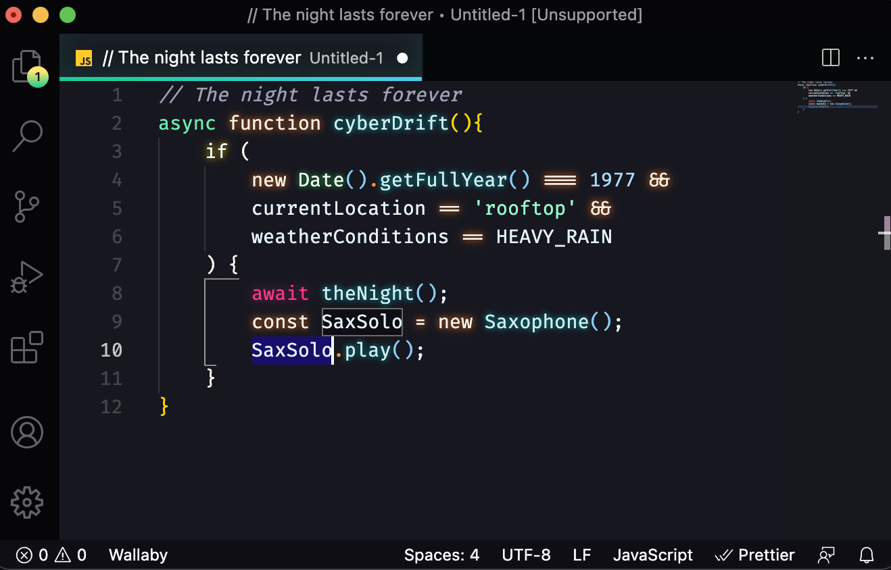

## Inspiration
The current work is practically branched from Robb Owen's [Synthwave '84](https://github.com/robb0wen/synthwave-vscode), bringing a dark twist to the original theme's unique glowing vision.

The color scheme reference for this theme has its roots in [this Cyberpunk 77 artwork](https://www.iamag.co/the-art-of-cyberpunk-2077/#jp-carousel-336960), being tweaked and tested for [accessibility](http://www.color-blindness.com/coblis-color-blindness-simulator/).

## Installation
[Install the theme from the VS Marketplace](https://marketplace.visualstudio.com/items?itemName=CodeReviewer14.cyber77-vscode).

Synthwave '84 disclamer warns us that *VS code doesn't natively support text effects and as a result, the glow is experimental. It's likely to be buggy and, whilst it looks rad, it isn't intended for extended use*. 

### To enable the glow
Open your command palette with `Ctrl + Shift + P` or `Shift + ⌘ + P` and choose "Cyber '77: Enable Neon Dreams". It will prompt you to restart, and when this is done, the glow should be activated.

## Updates
Every time you update or restart VS Code, you will need to repeat this step to re-enable the glow.

## Disabling the glow and uninstallation
If you want to disable the glow, one can open their command palette with `Ctrl + Shift + P` or `Shift + ⌘ + P` and choose "Cyber '77: Disable Neon Dreams".

## Compatibility
I primarily develop in HTML & CSS, JS and React so other languages/paradigms are not supported for now.

## Contributing
I believe contributions should be done to the base theme at [Synthwave '84](https://github.com/robb0wen/synthwave-vscode). Before you make any changes, [please read the contribution guide](https://github.com/robb0wen/synthwave-vscode/blob/master/CONTRIBUTING.md).

## Thanks
Needless to say, this variation would not have existed if it weren't for the work of Robb Owen's [Synthwave '84](https://github.com/robb0wen/synthwave-vscode) whose original theme made me open my IDE with joy daily.
